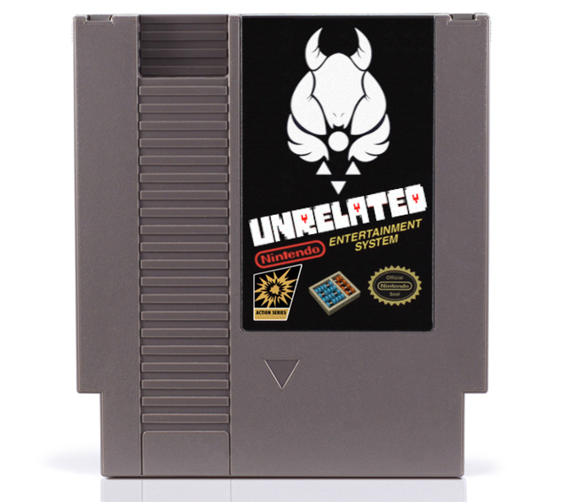

# EmuParadise
NES Emulator Project for MC861/MC871.

## Phase 1: Give the (NES) game away


**Requirements:**

* [asm6f](https://github.com/freem/asm6f) to assemble the game
* [mednafen](https://mednafen.github.io/) to run it

Once inside the UNRELATED folder, run these commands to assemble and play the game:

```
$ asm6f main.asm game.nes
$ mednafen game.nes
```

NES Emulator Project

**Integrantes do Grupo:**

- 157642 - Alex Wei
- 155943 - João Víctor Brazileu Spuri
- 166779 - Eduardo Moreira Freitas de Souza
- 176522 - Jonathas Rocha Limirio Sardinha
